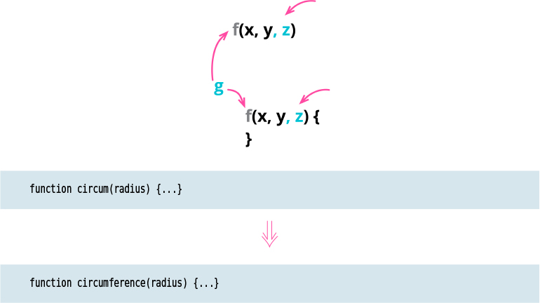

# Change Function Declaration (Rename Function)

Tags: refactor

# Motivation

If I see a function with the wrong name, it is imperative that I change it as soon as I understand 
what a better name could be. That way, the next time I’m looking at this code, I don’t have to
figure out again what’s going on. (Often, a good way to improve a name is to write a comment to 
describe the function’s purpose, then turn that comment into a name.)

Similar logic applies to a function’s parameters. The parameters of a function dictate how a 
function fits in with the rest of its world. Parameters set the context in which I can use a 
function. If I have a function to format a person’s telephone number, and that function takes a 
person as its argument, then I can’t use it to format a company’s telephone number. If I replace
the person parameter with the telephone number itself, then the formatting code is more widely 
useful.