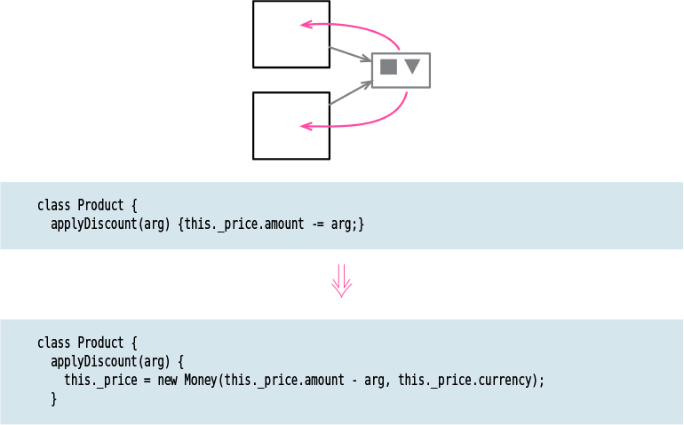

# Change Reference to Value

**Tags:** organizing data, refactor
**Inverse:**  
[Change Value to Reference](../Change%20Value%20to%20Reference/Change%20Value%20to%20Reference.md) 

# Motivation

When I nest an object, or data structure, within another I can treat the inner object as a
reference or as a value. The difference is most obviously visible in how I handle updates
of the inner object’s properties. If I treat it as a reference, I’ll update the inner object’s
property keeping the same inner object. If I treat it as a value, I will replace the entire
inner object with a new one that has the desired property. Value objects are generally easier to
reason about, particularly because they are immutable. In general, immutable data structures are easier to deal with.

This also suggests when I shouldn’t do this refactoring. If I want to share an object
between several objects so that any change to the shared object is visible to all its
collaborators, then I need the shared object to be a reference.

# Code
[Java code](../../java-code/src/main/java/refactoring/organizing_data/change_reference_to_value)
[Go code](../../go-code/organizing_data/change_reference_to_value)