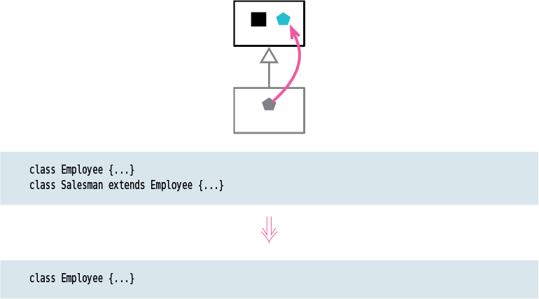

# Collapse Hierarchy

Tags: dealing with inheritance, refactor

# Motivation

When refactoring a class hierarchy, it is common to rearrange features. As the hierarchy evolves, it may become apparent that a class and its parent are not that different to keep them separate. In this case, it is appropriate to merge them together.