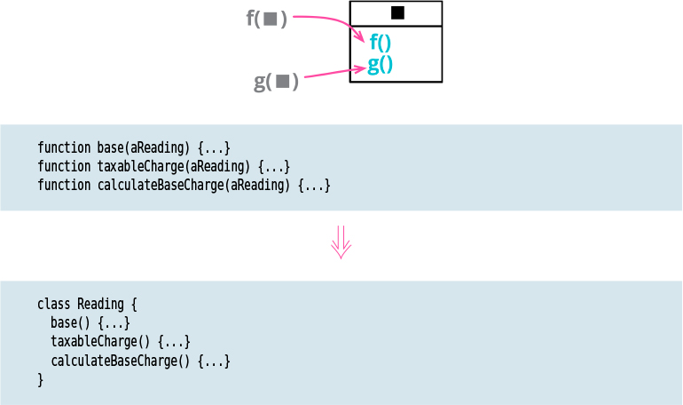

# Combine Functions into Class

**Tags:** basic
**Related:**  
[Combine Functions into Transform](../Combine%20Functions%20into%20Transform/Combine%20Functions%20into%20Transform.md)

# Motivation

When I see a group of functions that operate closely together on a common body of data(usually 
passed as arguments to the function call), I see an opportunity to form a class. Using a class
makes the common environment that these functions share more explicit, allows me to simplify
function calls inside the object by removing many of the arguments, and provides a reference to
pass such an object to other parts of the system. 

In addition to organizing already formed functions, this refactoring also provides a good 
opportunity to identify other bits of computation and refactor them into methods on the new class.

# Code
[Java code](../../java-code/src/main/java/refactoring/basics/combine_functions_into_class)
[Go code](../../go-code/basics/combine_functions_into_class)