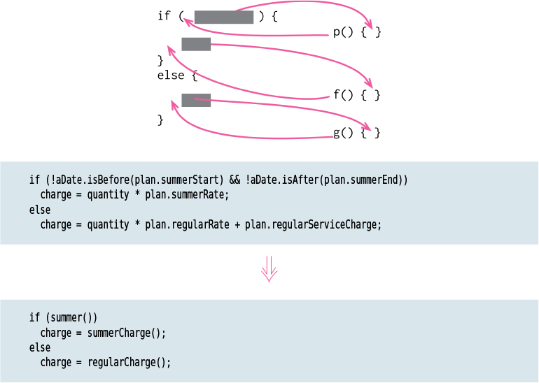

# Decompose Conditional

Tags: conditional logic, refactor
Related: Extract Function (Extract%20Function%20f20e8d100df7460e85563310e63c8312.md)

# Motivation

As with any large block of code, I can make my intention clearer by decomposing conditional logic and replacing each chunk of code with a function call named after the intention of that chunk. With conditions, I particularly like doing this for the conditional part and each of the alternatives. This way, I highlight the condition and make it clear what I’m branching on. I also highlight the reason for the branching.