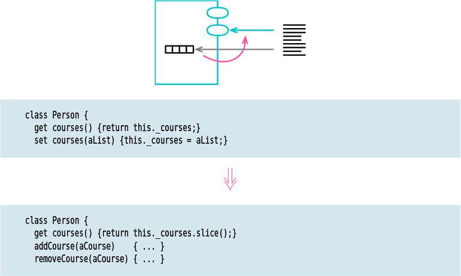

# Encapsulate Collection

Tags: refactor

![Picture]

# Motivation

Access to a collection variable may be encapsulated, but if the getter returns the
collection itself, then that collection’s membership can be altered without the enclosing class being able to intervene.

To avoid this, I provide collection modifier methods—usually add and remove—on the class itself. This way, changes to the collection go through the owning class, giving me the opportunity to modify such changes as the program evolves.

One way to prevent modification of the underlying collection is by never returning a collection value. In this approach, any use of a collection field is done with specific methods on the owning class, replacing `aCustomer.orders.size` with`aCustomer.numberOfOrders`. So we kind of wrap the collection object in our own class. I don’t agree with this approach. Modern languages have rich collection classes with standardized interfaces, which can be combined in useful ways such as Collection Pipelines. Putting in special methods to handle this kind of functionality adds a lot of extra code and cripples the easy composability of collection operations.

Another way is to allow some form of readonly access to a collection. Java, for
example, makes it easy to return a readonly proxy to the collection. Such a proxy
forwards all reads to the underlying collection, but blocks all writes—in Java’s case, throwing an exception. A similar route is used by libraries that. (NEVER USED)

Probably the most common approach is to provide a getting method for the collection, but make it return a copy of the underlying collection. That way, any modifications to the copy don’t affect the encapsulated collection. If the
collection is huge, this may be a performance issue