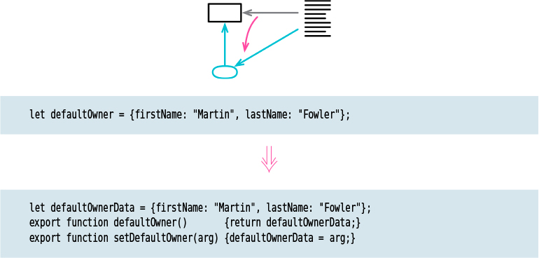

# Encapsulate Variable

Tags: encapsulation, refactor

![Picture]

## Motivation

**Note from me:** When the variables are private, this refactoring wont be needed

 

So if I want to move widely accessed data, often the best approach is to first encapsulate it by routing all its access through functions. That way, I turn the difficult task of reorganizing data into the simpler task of reorganizing functions.

The basic refactoring encapsulates the reference to the data item. In many cases, this is all I want to do for the moment. But I often want to take the encapsulation deeper to control not just changes to the variable but also to its contents. For this, I have a couple of options. **The simplest one is to prevent any changes to the value. My favorite way to handle this is by modifying the getting function to return a copy of the data.**