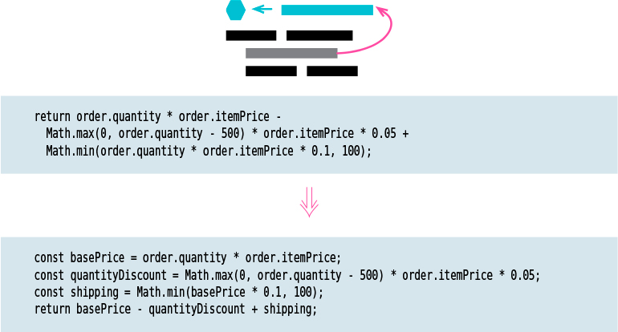

# Extract Variable

Tags: refactor
Inverse: Inline Variable (../Inline%20Variable/Inline%20Variable.md)

# Motivation

Expressions can become very complex and hard to read. In such situations, local
variables may help break the expression down into something more manageable. 

In particular, they give me an ability to name a part of a more complex piece of logic. This allows me to better understand the purpose of what’s happening.
Such variables are also handy for debugging, since they provide an easy hook for a debugger or print statement to capture.

# Mechanics

- Declare an immutable variable. Set it to a copy of the expression you want to name.
-