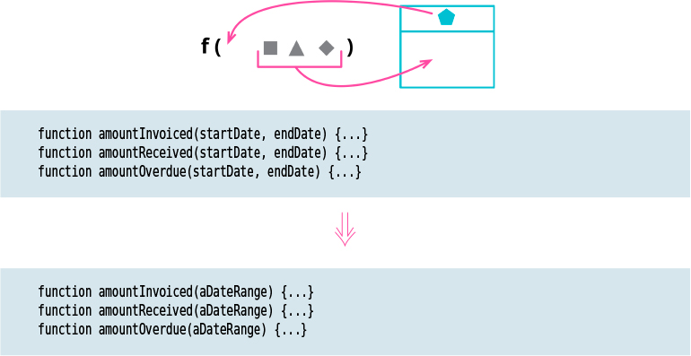

# Introduce Parameter Object

Tags: basic

![]

# Motivation

I often see groups of data items that regularly travel together, appearing in function after function. Such a group is a data clump, and I like to replace it with a single data structure.

Grouping data into a structure is valuable because it makes explicit the relationship between the data items. It reduces the size of parameter lists for any function that uses the new structure. It helps consistency since all functions that use the structure will use the same names to get at its elements.