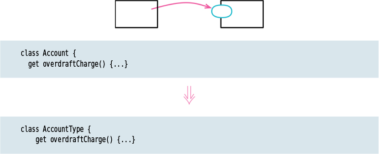

# Move Function

Tags: moving features, refactor

# Motivation

The heart of a good software design is its modularity. To get this modularity, I need to ensure that related software elements are grouped together and the links between them are easy to find and understand. But my understanding of how to do this isn’t static—as I better understand what I’m doing, I learn how to best group together software elements. So modularity of the classes are always a work-in-progress process.

One of the most straightforward reasons to move a function is when it references elements in other contexts more than the one it currently resides in. Moving it together with those elements often improves encapsulation, allowing other parts of the software to be less dependent on the details of this module.

Deciding to move a function is rarely an easy decision. To help me decide, I examine the current and candidate contexts for that function. I need to look at what functions call this one, what functions are called by the moving function, and what data that function uses. Often, I see that I need a new context for a group of functions and create one with Combine Functions into Class (144) or Extract Class (182). Although it can be difficult to decide where the best place for a function is, the more difficult this choice, often the less it matters.