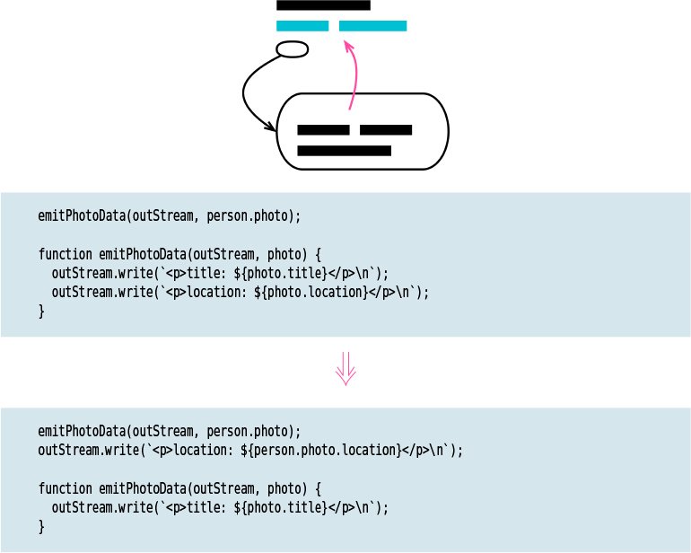

# Move Statement to Callers

Tags: moving features

# Motivation

One trigger for this is when common behavior used in several places needs to vary in
some of its calls. Now, we need to move the varying behavior out of the function to its
callers. In this case, I’ll use Slide Statements (223) to get the varying behavior to the
beginning or end of the function and then Move Statements to Callers. Once the varying
code is in the caller, I can change it when necessary.