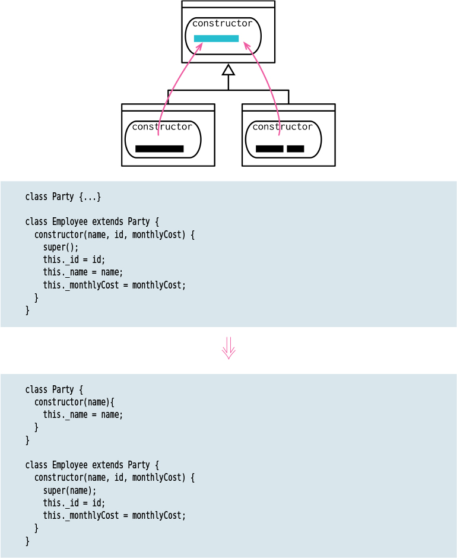

# Pull up Constructor Body

Tags: dealing with inheritance, refactor

# Motivation

If I see subclass methods with common behavior, my first thought is to use [Extract Function](Extract%20Function%20f20e8d100df7460e85563310e63c8312.md) followed by [Pull up Method](Pull%20up%20Method%2085b731771ff546bd9511d54d927a9d96.md), which will move it nicely into the superclass. Constructors tangle that—because they have special rules about what can be done in what order, so I need a slightly different approach.

If this refactoring starts getting messy, I reach for [Replace Command with Function](Replace%20Command%20with%20Function%207c50ea9c7d234d7abcb75dbce47334fc.md).