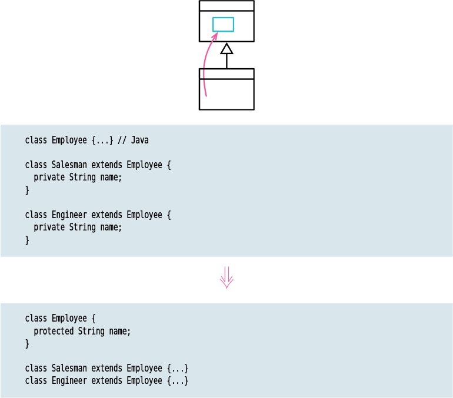

# Pull up Field

Tags: dealing with inheritance, refactor

# Motivation

If subclasses are developed independently, or combined through refactoring, I often find that they duplicate features. In particular, certain fields can be duplicates. Such fields sometimes have similar names—but not always. The only way I can tell what is going on is by looking at the fields and examining how they are used. If they are being used in a similar way, I can pull them up into the superclass.

By doing this, I reduce duplication in two ways. I remove the duplicate data declaration and I can then move behavior that uses the field from the subclasses to the superclass.

# Code examples

The example for [Pull up Method](../Pull%20up%20Method/Pull%20up%20Method.md) includes this refactoring too.