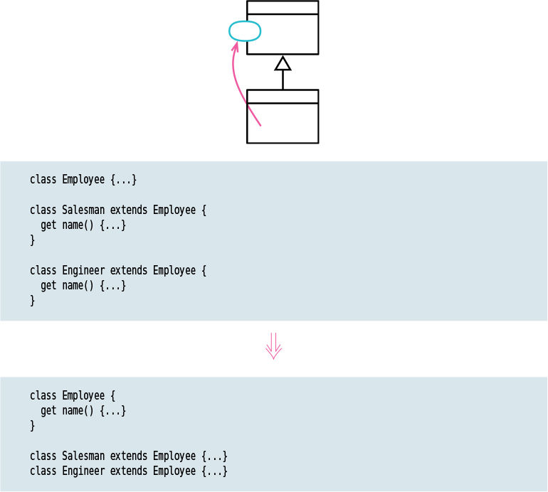

# Pull up Method

Tags: dealing with inheritance, refactor

# Motivation

Eliminating duplicate code is important. Two duplicate methods may work fine as they are, but 
they are nothing but a breeding ground for bugs in the future. Whenever there is duplication,
there is risk that an alteration to one copy will not be made to the other. Usually, it is difficult to find the duplicates.

The easiest case of using Pull Up Method is when the methods have the same body, implying there’s
been a copy and paste. Of course it’s not always as obvious as that. I usually find it valuable to
look for the differences—often, they show up behavior that I forgot to test for.

Often, Pull Up Method comes after other steps. I see two methods in different classes that can be
parameterized in such a way that they end up as essentially the same method. In that case, the 
smallest step is for me to apply [Parameterize Function](../Parameterize%20Function/Parameterize%20Function.md) separately and then Pull Up Method.

The most awkward complication with Pull Up Method is if the body of the method refers to features 
that are on the subclass but not on the superclass. When that happens, I need to use
[Pull Up Field](../Pull%20up%20Field/Pull%20up%20Field.md) and Pull Up Method on those elements first.

If I have two methods with a similar overall flow, but differing in details, I’ll consider the **Template Pattern**.

# Code Examples

- **Go:** Since go doesnt support inheritance, this refactoring cannot really be applied 
in go language. In Go, composition is favored over inheritance. So [Move Function](Move%20Function%20b296fdf48e6a42039e56c135f4825f68.md) 
- can be applied in that kind of situations.