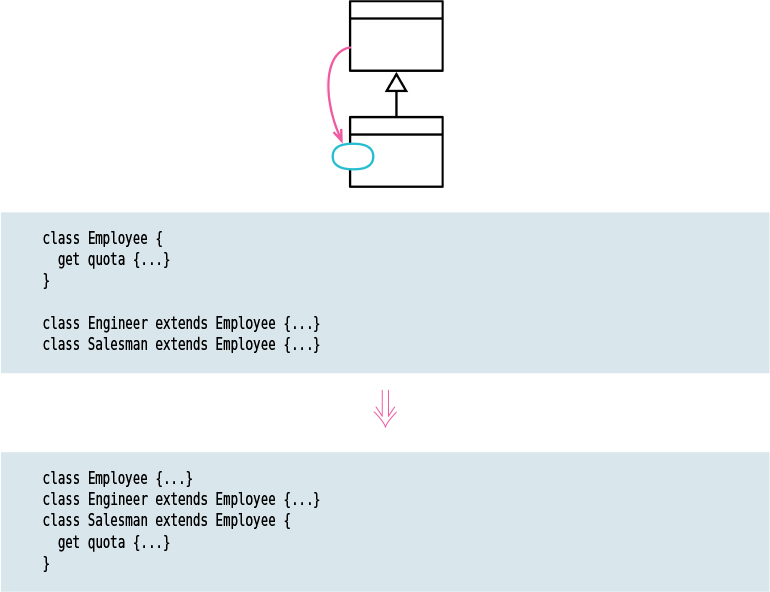

# Push Down Method

Tags: dealing with inheritance, refactor
Inverse: Pull up Method (Pull%20up%20Method%2085b731771ff546bd9511d54d927a9d96.md)

# Motivation

If a method is only relevant to one subclass (or a small proportion of subclasses), removing it from the superclass and putting it only on the subclass(es) makes that clearer