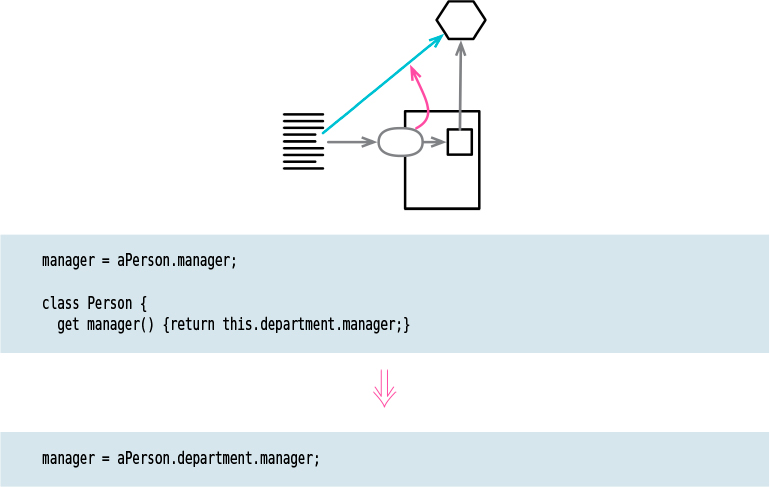

# Remove Middle Man

Tags: encapsulation, refactor
Inverse: [Hide Delegate](../Hide%20Delegate/Hide%20Delegate.md)

# Motivation

In the motivation for Hide Delegate (189), I talked about the advantages of
encapsulating the use of a delegated object. There is a price for this. Every time the client 
wants to use a new feature of the delegate, I have to add a simple delegating method to the server. 
After adding features for a while, I get irritated with all this forwarding. The server class is 
just a middle man (Middle Man (81)), and perhaps it’s time for the client to call the delegate
directly. (This smell often pops up when people get overenthusiastic about following the Law of 
Demeter, which I’d like a lot more if it were called the Occasionally Useful Suggestion of Demeter.)

It’s hard to figure out what the right amount of hiding is. Fortunately, with Hide
Delegate (189) and Remove Middle Man, it doesn’t matter so much. I can adjust my code as time goes 
on. As the system changes, the basis for how much I hide also changes. A good encapsulation six 
months ago may be awkward now. Refactoring means I never have to say I’m sorry—I just fix it.