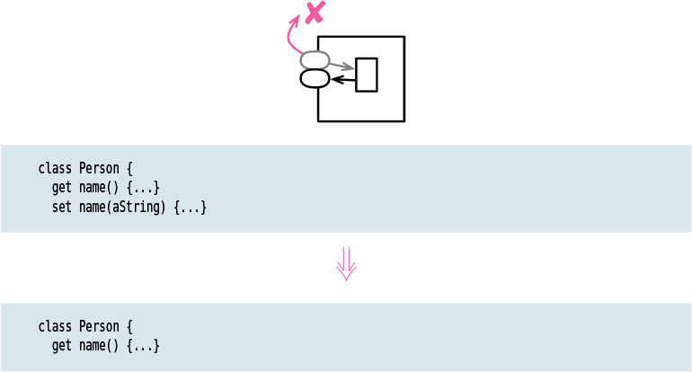

# Remove Setting Method

Tags: refactor, refactoring api

# Motivation

Providing a setting method indicates that a field may be changed. If I don’t want that field to
change once the object is created, I don’t provide a setting method (and make the field immutable).
That way, the field is set only in the constructor, my intention to have it not change is clear,
and I usually remove the very possibility that the field will change.