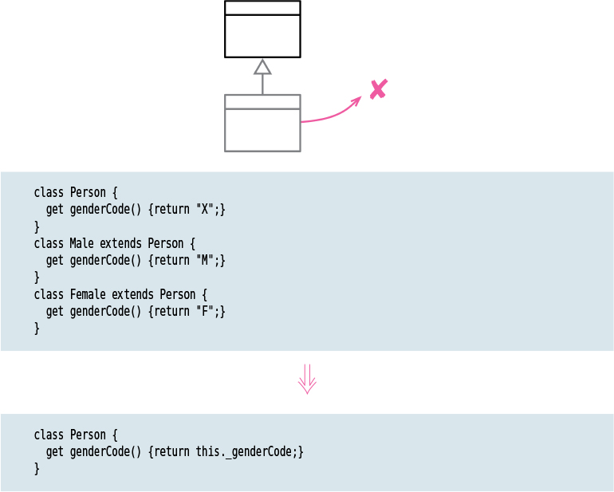

# Remove Subclass

Tags: dealing with inheritance, refactor
Inverse: [Replace Type Code with Subclasses](../Replace%20Type%20Code%20with%20Subclasses/Replace%20Type%20Code%20with%20Subclasses.md)

# Motivation

A subclass that does too little incurs a cost in understanding that is no longer
worthwhile. When that time comes, it’s best to remove the subclass, replacing it with a field on its superclass.