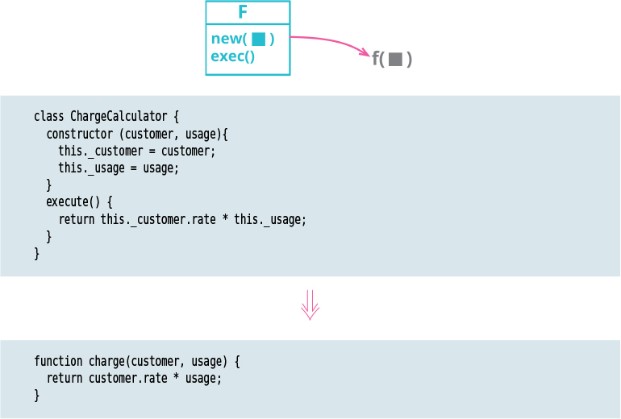

# Replace Command with Function

Tags: refactor, refactoring api
Inverse: [Replace Function with Command](../Replace%20Function%20with%20Command/Replace%20Function%20with%20Command.md)

# Motivation

Command objects provide a powerful mechanism for handling complex computations. They can easily be broken down into separate methods sharing common state through the fields; they can be invoked via different methods for different effects; they can have their data built up in stages. But that power comes at a cost. Most of the time, I just want to invoke a function and have it do its thing. If that’s the case, and the function isn’t too complex, then a command object is more trouble than its worth and should be turned into a regular function.