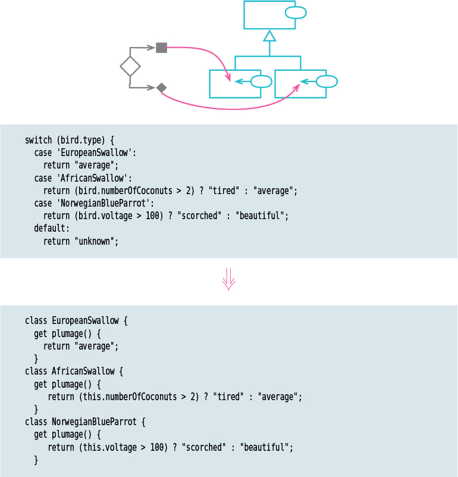

# Replace Conditional with Polymorphism

Tags: conditional logic, refactor

# Motivation

Complex conditional logic is one of the hardest things to reason about in programming, so I always
look for ways to add structure to conditional logic. Often, I find I can separate the logic into
different circumstances—highlevel cases—to divide the conditions. Sometimes it’s enough to represent
this division within the structure of a conditional itself, but using classes and polymorphism can 
make the separation more explicit.

# Mechanics

- If classes do not exist for polymorphic behavior, create them together with a factory function to
return the correct instance.
- Use the factory function in calling code.
- Move the conditional function to the superclass.
- If the conditional logic is not a selfcontained function, use Extract Function (106) to make it so.
- Pick one of the subclasses. Create a subclass method that overrides the conditional statement 
method. Copy the body of that leg of the conditional statement into the subclass method and adjust it to fit.
- Repeat for each leg of the conditional.
- Leave a default case for the superclass method. Or, if superclass should be abstract, declare 
that method as abstract or throw an error to show it should be the responsibility of a subclass.