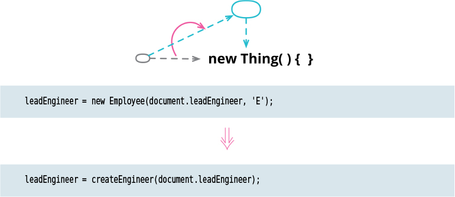

# Replace Constructor with Factory Function

Tags: refactor, refactoring api

# Motivation

Many objectoriented languages have a special constructor function that’s called to initialize an 
object. Clients typically call this constructor when they want to create a new object. But these
constructors often come with awkward limitations that aren’t there for more general functions. A 
Java constructor must return an instance of the class it was
called with, which means I can’t replace it with a subclass or proxy depending on the environment
or parameters. Constructor naming is fixed, which makes it impossible for me to use a name that 
is clearer than the default. Constructors often require a special operator to invoke (“new” 
in many languages) which makes them difficult to use in contexts that expect normal functions. 

A factory function suffers from no such limitations. It will likely call the constructor as part 
of its implementation, but I can freely substitute something else.