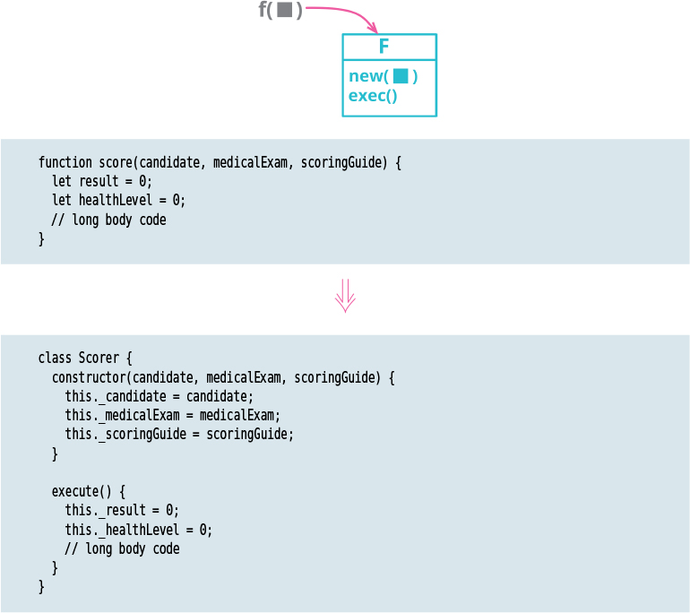

# Replace Function with Command

Tags: refactor, refactoring api
Inverse: [Replace Command with Function](../Replace%20Command%20with%20Function/Replace%20Command%20with%20Function.md)

# Motivation

There are times when it’s useful to encapsulate a function into its own object, which I refer to as 
a “command object” or simply a command. Such an object is mostly built around a single method, 
whose request and execution is the purpose of the object.