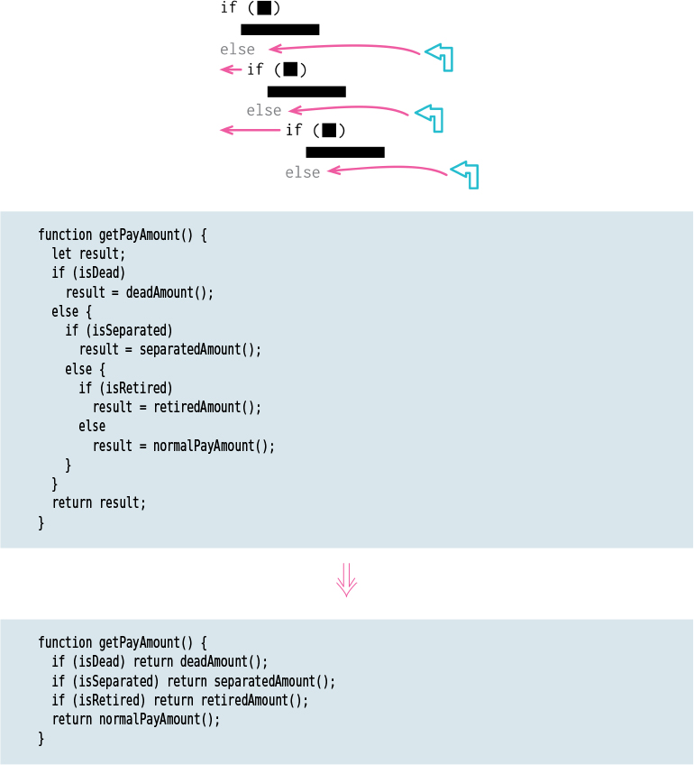

# Replace Nested Conditional With Guard Clauses

Tags: conditional logic, refactor

# Motivation

I often find that conditional expressions come in two styles. In the first style, both legs of the conditional are part of normal behavior, while in the second style, one leg is normal and the other indicates an unusual condition.

These kinds of conditionals have different intentions—and these intentions should come through in the code. If both are part of normal behavior, I use a condition with an if and an else leg. If the condition is an unusual condition, I check the condition and return if it’s true. This kind of check is often called a guard clause.

This communicates to the reader that the legs are equally likely and important. Instead, the guard clause says, “This isn’t the core to this function, and if it happens, do something and get out.”

# Mechanics

- Select outermost condition that needs to be replaced, and change it into a guard clause.
- Test.
- Repeat as needed.
- If all the guard clauses return the same result, use [Consolidate Conditional Expression](Consolidate%20Conditional%20Expression%20eefa79072a6c4b6a94d220b2b805ab03.md)