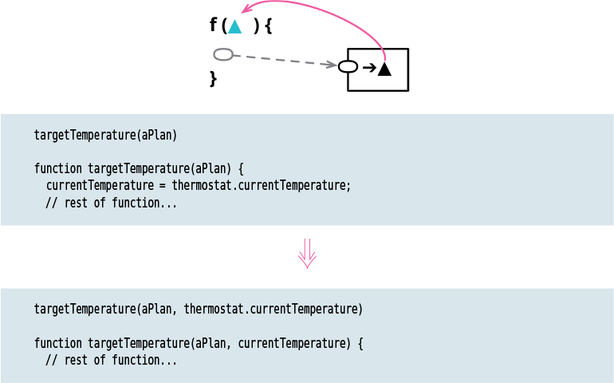

# Replace Query with Parameter

Tags: refactor, refactoring api
Inverse: [Replace Parameter with Query](../Replace%20Parameter%20with%20Query/Replace%20Parameter%20with%20Query.md)

# Motivation

When looking through a function’s body, I sometimes see references to something in the function’s scope that I’m not happy with. This might be a reference to a global variable, or to an element in the same module that I intend to move away. To resolve this, I need to replace the internal reference with a parameter, shifting the responsibility of resolving the reference to the caller of the function.