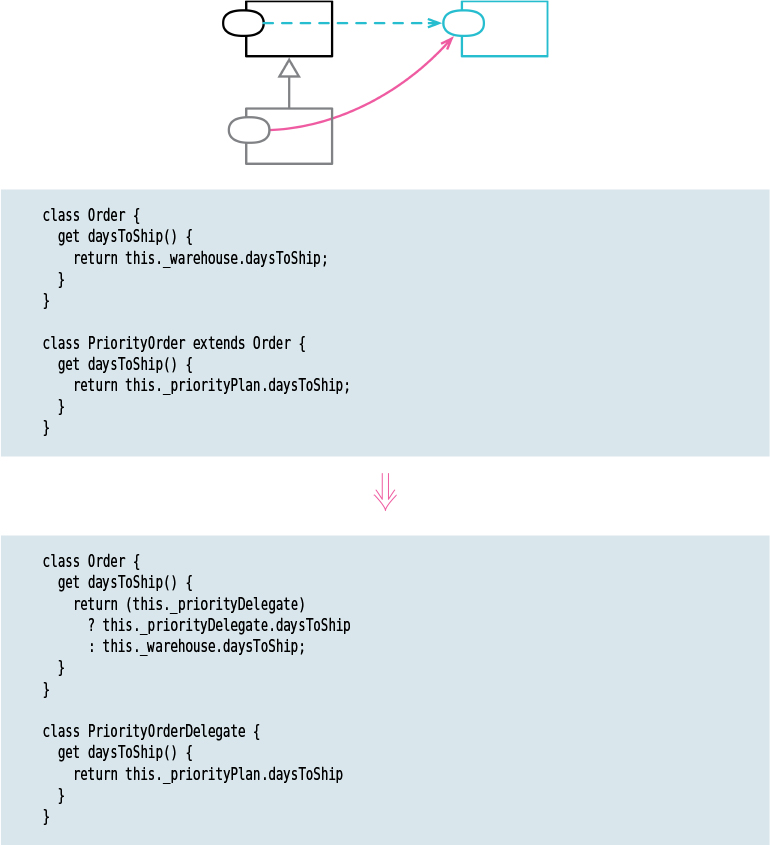

# Replace Subclass with Delegate

Tags: dealing with inheritance, refactor

# Motivation

If there are more than 1 reason to vary something in the inheritance hierarchy, inheritance is not enough.

We usually take the similar behaviours to a base class and use inheritance. However, inheritance
comes with its own problems. Inheritance introduces dependency problems. A behaviour in the base 
class could cause changes in the subclasses. 

Delegation (composition) handles these problem. 

This refactoring could be considered as replacing subclasses with the State or Strategy patterns. 
Both of these patterns are structurally the same, relying on the host delegating to a separate
hierarchy. Setting up a hierarchy for states or strategies is often useful.