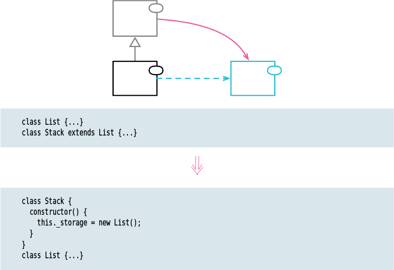

# Replace Superclass with Delegate

Tags: dealing with inheritance, refactor

# Motivation

If functions of the superclass don’t make sense on the subclass, that’s a sign that I shouldn’t be
using inheritance to use the superclass’s functionality.