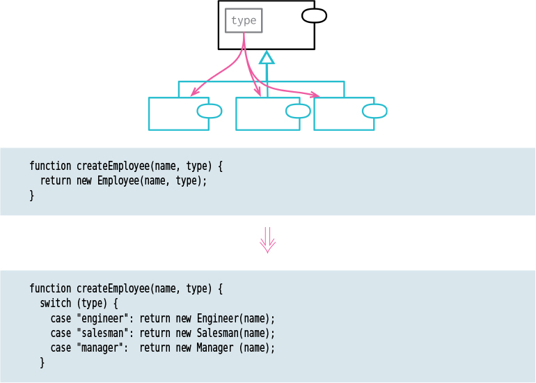

# Replace Type Code with Subclasses

Tags: dealing with inheritance, refactor
Inverse: [Remove Subclass](../Remove%20Subclass/Remove%20Subclass.md)

# Motivation

Software systems often have to represent various types of similar things. For instance, employees
can be classified by their job type (such as engineer, manager, or salesman), or orders can be 
categorized by their priority (such as rush or regular). One way to handle this is by using a type
code field. Depending on the programming language, this may be an enum, symbol, string, or number.

Usually, this type code is enough. However, there are a few cases where I need something extra, 
and that something is subclasses. There are two main benefits of subclasses. The first is that 
they let me use polymorphism to manage conditional logic.

The second case is where I have fields or methods that are only valid for particular values of a
type code, such as a sales quota that’s only applicable to the “salesman” type code. I can then 
create the subclass and apply [Push down Field](../Push%20down%20Field/Push%20down%20Field.md) .