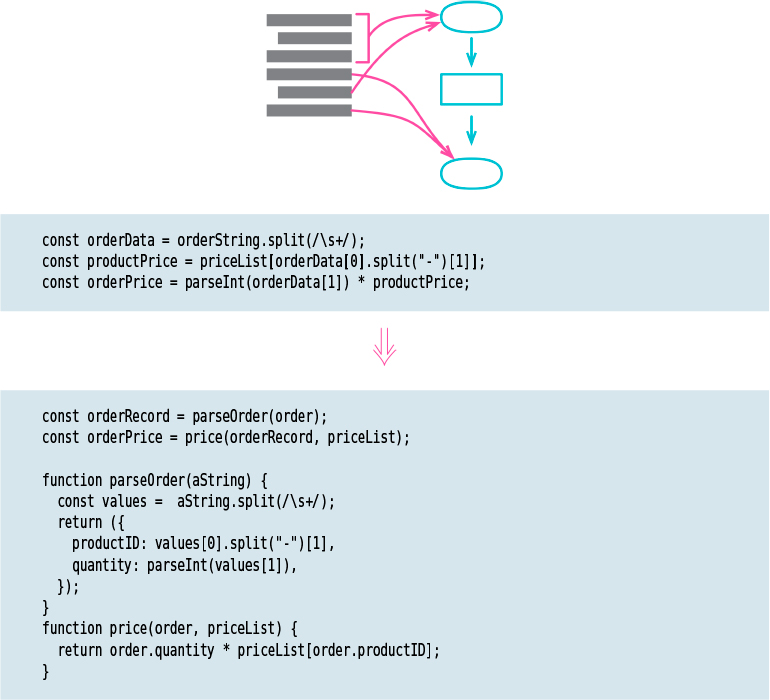

# Split Phase

Tags: basic

# Motivation

**When I run into code that’s dealing with two different things, I look for a way to split it
into separate modules.** I endeavor to make this split because, if I need to make a change, 
I can deal with each topic separately and not have to hold both in my head together. If I’m lucky,
I may only have to change one module without having to remember the details of the other one at all.