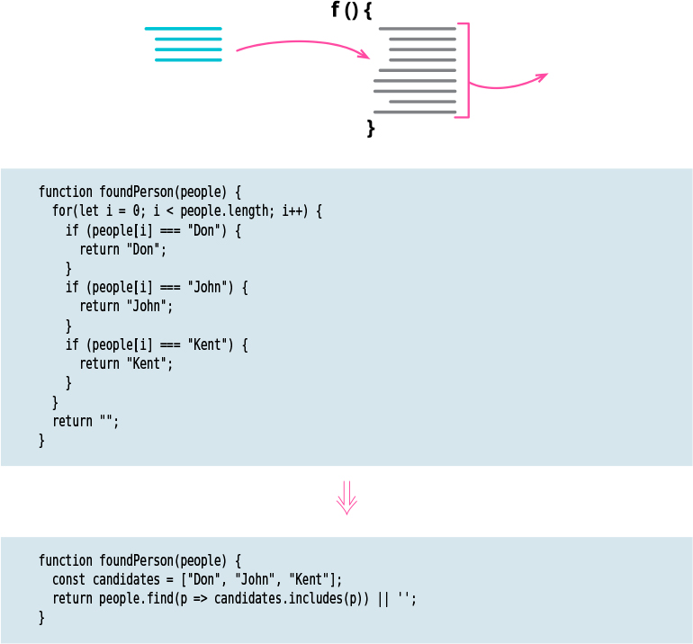

# Substitute Algorithm

Tags: dealing with inheritance

![]

# Motivation

Refactoring can break down something complex into simpler pieces, but sometimes I just reach the 
point at which I have to remove the whole algorithm and replace it with something simpler. This 
occurs as I learn more about the problem and realize that there’s an easier way to do it. It also
happens if I start using a library that supplies features that duplicate my code. 

Sometimes, when I want to change the algorithm to work slightly differently, it’s easier to start
by replacing it with something that would make my change more
straightforward to make.

When I have to take this step, I have to be sure I’ve decomposed the method as much as I can. 
Replacing a large, complex algorithm is very difficult. only by making it simple can I make the
substitution tractable.